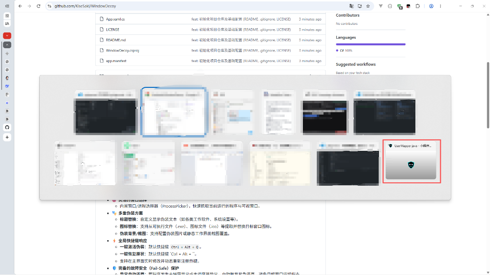
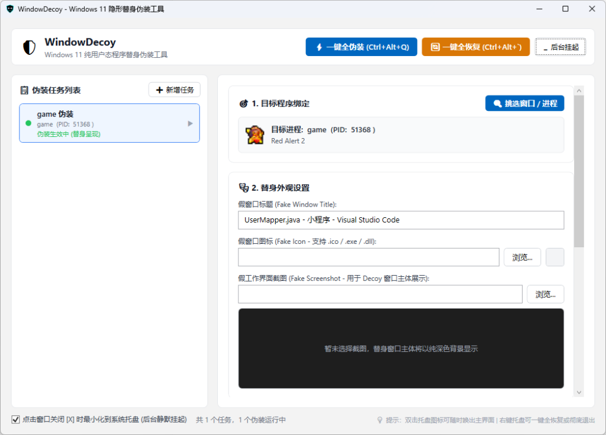
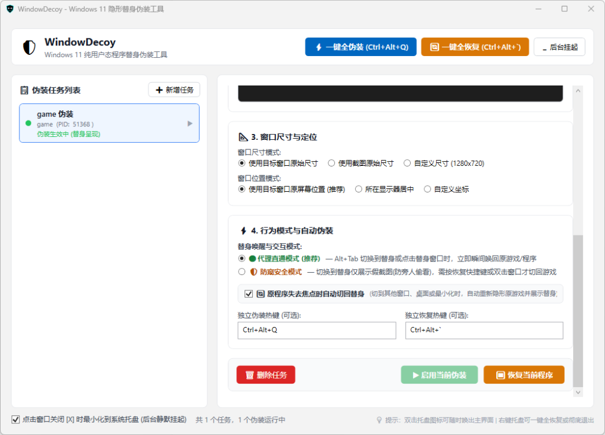

# WindowDecoy (Win伪装)

> 一款基于 WPF (.NET 10) 开发的 Windows 窗口伪装与防窥保护工具。


---

## 📖 项目简介

**WindowDecoy** 专为保护桌面隐私与防窥设计。在需要临时离开座位、他人靠近或需要快速隐藏敏感内容时，WindowDecoy 能够通过全局快捷键迅速将目标窗口进行伪装（替换虚假标题、替换窗口图标或覆盖伪装画面/假截图），并在需要时一键无缝还原。

---

## 🖼️ 效果与界面展示

### 1. Alt+Tab 任务切换伪装效果

> 💡 **效果说明**：上图展示了 Windows `Alt + Tab` 任务切换视图，**红框框住的部分即为伪装后的替身窗口**（实时替换为伪装标题、伪装图标及预设的虚假工作缩略图，完美融入日常工作界面）。

### 2. 目标程序绑定与替身外观设置

> 💡 **功能说明**：支持快速挑选并绑定目标窗口/进程，灵活配置虚假窗口标题（如各类代码文件、办公文档）、替换窗口图标，并支持导入虚假工作界面截图作为替身主体。

### 3. 窗口定位与高级行为模式

> 💡 **功能说明**：
> - **尺寸与定位**：支持跟随原窗口尺寸位置、居中显示或指定自定义坐标。
> - **代理直通模式**：`Alt + Tab` 切换至替身或点击替身时，瞬间无感唤回原程序。
> - **防窥安全模式**：切换至替身仅展示静态假截图，必须按下恢复快捷键或双击窗口才可切回。
> - **失焦自动伪装**：原程序失去焦点（切换到其他窗口、返回桌面或最小化）时，自动重新隐形并切回替身保护。

---

## ✨ 核心特性

- 🎯 **灵活的窗口选择**
  - 内置窗口/进程选择器（ProcessPicker），快速抓取当前运行的程序与可视窗口。
- 🎭 **多重伪装方案**
  - **标题替换**：自定义显示伪装文本（如各类工作软件、系统设置等）。
  - **图标替换**：支持从可执行文件（.exe）、图标文件（.ico）等提取并替换目标窗口图标。
  - **伪装背景/截图**：支持配置伪装图片或静态工作界面截图覆盖。
- ⚡ **全局快捷键响应**
  - **一键激活伪装**：默认快捷键 `Ctrl + Alt + Q`。
  - **一键恢复原状**：默认快捷键 `Ctrl + Alt + \``。
  - 支持在主界面实时修改并动态重新注册热键。
- 🛡️ **完备的故障安全（Fail-Safe）保护**
  - **异常自动还原**：若程序发生未捕获异常或主调度器异常，自动触发紧急还原，避免目标窗口遗留假态。
  - **系统关机/注销保护**：监听到系统会话结束信号时自动释放所有伪装。
  - **安全退出**：软件正常退出或强制退出时确保所有被控窗口恢复原始状态。
- 📌 **系统托盘与静默运行**
  - 支持关闭窗口时最小化到系统托盘，后台持续响应全局快捷键。
  - 托盘右键菜单支持一键还原所有窗口、唤出主界面或退出程序。

---

## 🛠️ 技术栈

- **框架**：.NET 10.0 (WPF - Windows Presentation Foundation)
- **语言**：C# 13 (Nullable & ImplicitUsings 开启)
- **底层技术**：Win32 P/Invoke API (`user32.dll`, `kernel32.dll`, `dwmapi.dll` 等)
  - 窗口句柄枚举与状态保存 (`EnumWindows`, `GetWindowText`, `GetWindowLongPtr`)
  - 窗口样式与属性动态调整 (`SetWindowLongPtr`, `SetWindowPos`, `SetWindowText`)
  - 全局热键注册与消息泵循环 (`RegisterHotKey`, `UnregisterHotKey`, `HwndSource`)
  - 图标提取与内存图像转换 (`ExtractIconEx`, `GetIconInfo`)

---

## 📁 目录结构

```
Win伪装/
├── Assets/                 # 静态资源文件（程序图标等）
├── Converters/             # WPF XAML 数据转换器
├── Interop/                # Win32 原生 API P/Invoke 签名与结构体定义
├── Models/                 # 数据模型（会话配置、窗口状态、枚举等）
├── Services/               # 核心服务（DecoyManager, HotkeyManager, WindowController等）
├── ViewModels/             # MVVM 视图模型（MainViewModel, RelayCommand等）
├── Views/                  # WPF 界面（MainWindow, DecoyWindow, ProcessPickerWindow）
├── App.xaml / App.xaml.cs  # 应用程序入口与全局容灾逻辑
├── app.manifest            # Windows DPI 识别与权限声明清单
├── WindowDecoy.csproj      # 项目配置文件 (.NET 10.0-windows)
├── .gitattributes          # Git 属性配置
├── .gitignore              # Git 忽略文件规则
├── LICENSE                 # 开源许可证 (MIT)
└── README.md               # 项目说明文档
```

---

## 🚀 快速开始

### 前置要求

- **操作系统**：Windows 10 / 11 64位
- **开发运行环境**：[.NET 10.0 SDK](https://dotnet.microsoft.com/)

### 编译与运行

1. 克隆或下载代码到本地：
   ```bash
   git clone <repository-url>
   cd Win伪装
   ```

2. 恢复依赖并编译项目：
   ```bash
   dotnet build -c Release
   ```

3. 运行应用程序：
   ```bash
   dotnet run -c Release
   ```

4. 或发布为单文件可执行程序：
   ```bash
   dotnet publish -c Release -r win-x64 --self-contained false -o ./Output
   ```

---

## ⌨️ 快捷键说明

| 功能 | 默认快捷键 | 说明 |
| :--- | :--- | :--- |
| **激活伪装** | `Ctrl + Alt + Q` | 立即激活已配置的窗口伪装模式 |
| **恢复原状** | `Ctrl + Alt + \`` | 立即还原所有窗口至正常状态 |

> 💡 可以在程序主界面中根据个人使用习惯自由配置快捷键组合。

---

## 📦 自动打包发布 (CI/CD)

项目已配置 GitHub Actions 自动化工作流（[.github/workflows/release.yml](.github/workflows/release.yml)）。

### 发布新版本流程

1. **通过 Git Tag 触发（推荐）**：
   打上版本 Tag 并推送到远程仓库：
   ```bash
   git tag v1.0.0
   git push origin v1.0.0
   ```
   工作流将自动触发，完成编译、测试并发布对应的 GitHub Release。

2. **通过 GitHub Actions 界面手动触发**：
   在 GitHub 仓库的 **Actions** -> **Build and Release** 页面中，点击 **Run workflow** 并输入版本号（如 `v1.0.0`）即可一键打包发布。

### 自动化构建产物说明

每次发布将自动生成两种规格的压缩包供用户下载：

| 压缩包文件 | 类型 | 说明与下载建议 |
| :--- | :--- | :--- |
| **`WindowDecoy-vX.X.X-win-x64-Standalone.zip`** | **独立运行版（推荐）** | **开箱即用，无需安装任何环境**。已内置完整 .NET 10 运行库并进行单文件封装，解压即可直接双击运行，适合绝大多数用户。 |
| **`WindowDecoy-vX.X.X-win-x64-Dependent.zip`** | **依赖运行库版** | **体积极小**。仅包含程序自身代码，需要目标机器已预先安装 [.NET 10 Desktop Runtime](https://dotnet.microsoft.com/)，否则无法启动。 |

---

## 📄 开源许可证

本项目采用 [MIT License](LICENSE) 授权开源。
